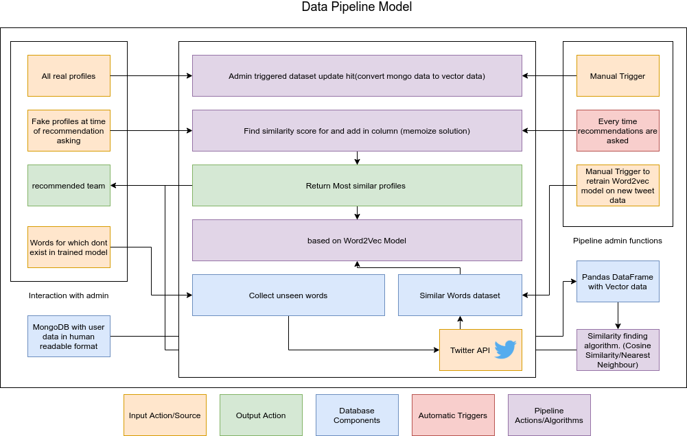
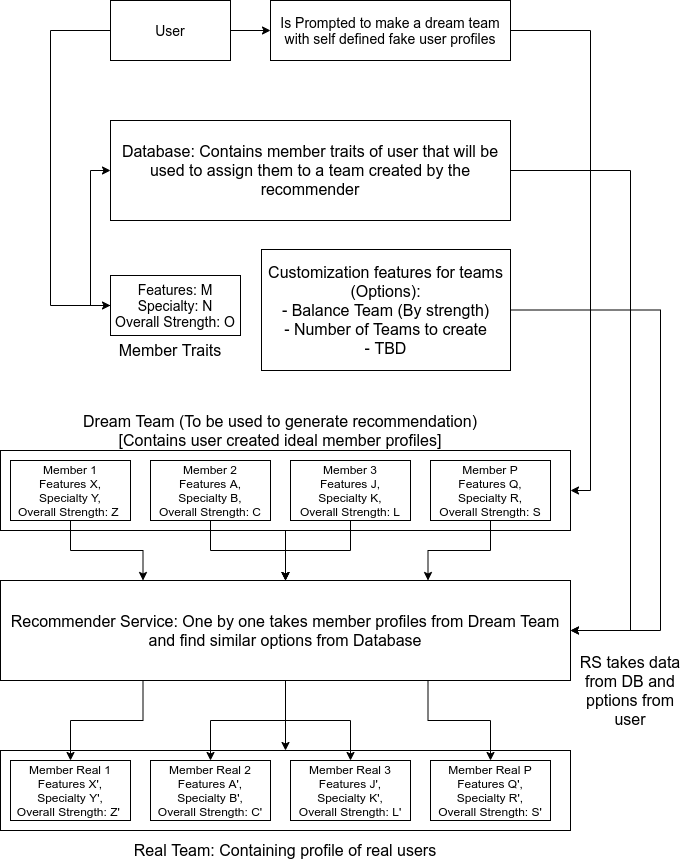

# Qupid
Qupid is a matchmaking service that is responsible for creating efficient teams for workplaces and classes.

Requires:

- Python & all listed requirements : FastAPI, Gensim, Matplotlib, Scikit-Learn, Pandas, Numpy, etc.
- MongoDB

## How to run

### backend

```
python app/main.py
```
> Spins up a fastapi server. To see what routes the backend offers visit http://localhost:8000/docs. features database and pipeline related functions(train model, refresh model, etc). 

### frontend

```
cd frontend/qupid
npm start
```
> Simple React + Material UI frontend 

## Pipeline 



## Current Core Word2Vec Model Insight


## Algorithm


