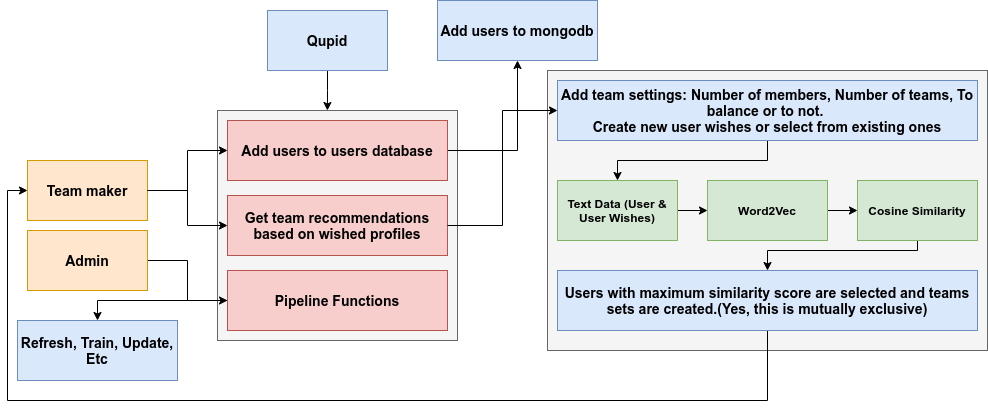

# Qupid

Qupid is a matchmaking service that is responsible for creating efficient teams for workplaces and classes. More details in [Presentation](Qupid_ Teams_Matchmaking_Service.pdf)



Requires:

- Python & all listed requirements : FastAPI, Gensim, Matplotlib, Scikit-Learn, Pandas, Numpy, etc.
- MongoDB

Info:

- Pictures of screens in [screens folder](screens)
- Word2Vec Analysis Images [analysis folder](analysis)
- Research and Experiments on model done in [Notebook](Data&Word2Vec.ipynb)
- Pipeline related, training model & generating insights code in [Pipeline route](app/server/routes/pipeline.py) & [Train Script](app/server/routes/model/train.py)
- Backend Code in [Server](app/server)
- Frontend Code in [Qupid FE](frontend/qupid)
## How to run

- Make sure you add you own twitter api key in `settings.env` as `"TW_KEY":"your_key_here"` in folder `app/server/routes/model/` 

### backend

```
python app/main.py
```
> Spins up a fastapi server. To see what routes the backend offers visit http://localhost:8000/docs. features database and pipeline related functions(train model, refresh model, etc). 

### frontend

```
cd frontend/qupid
npm start
```
> Simple React + Material UI frontend 

## How to Use ? 

### Find team recommendations

#### Team Settings 


#### Wish for certain kind of profiles


#### Get Teams


### Perform Pipeline realted functionality


### Add users to user database


### Recommendation System

## Pipeline 


## Current Core Word2Vec Model Insight


## Algorithm


